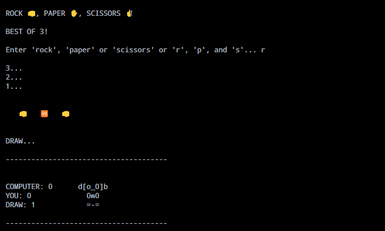
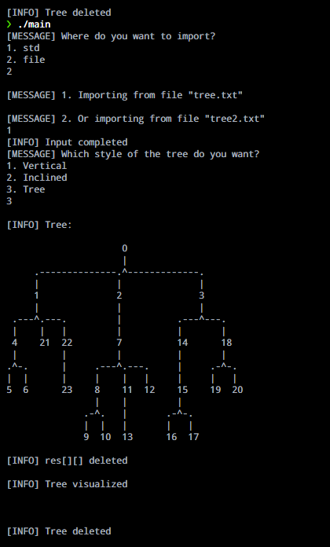
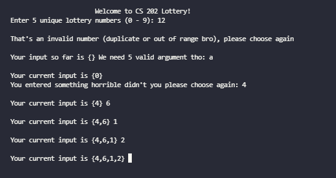
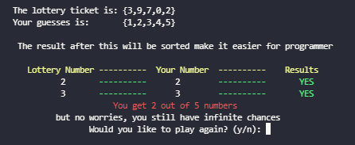

# Some Command Line Interaction

 will think about it, cause I really don't know how bad I am at coding. It really bad.

```bash
Command Line Interaction
  |
  |-- Command Line Games
  |     |
  |     |-- rockpaperscissor (python)
  |     |-- RussianRoutlette (java)
  |     |-- tictactoe (javascript)
  |     |-- Fish Tank (C++)
  |     |-- LotteryGame (C++)
  |     |-- cheapBattleRoyal (C++)
  |     |-- Tree Visualizer (C++)
  |
  |-- Good Practices
        |
        |-- parse CSV (2D array practices)
        |-- bitWise (C++)
        |-- others
```

## Command Line Games

Its self-explanatory. I have made some games in command line. I have used python, c++, java and javascript for this.

Down below are implementations.

### rockpaperscissor

<p align="center">
  
</p>

### tic tac toe

<p align="center">
  
</p>

### tree visualizer

<p align="center">
  
</p>

### Fish Tank

<p align="center">
  
</p>

### Lottery Game

<p align="center">
  
</p>

<p align="center">
  
</p>

## Good Practices

Some small pieces of code that I think are interesting.

### parse CSV

Just read it

### bitWise

AND, OR, XOR, did not include NOT, LSHIFT, RSHIFT

### Sorting n Search Algorithms

In C++, 7 algorithms implemented as well as different ways to implement them.

There is a 12th algorithm version but that is a bit stingy.

## License

  Copyright [2023] [Thien Nguyen]

  Licensed under the Apache License, Version 2.0 (the "License");
  you may not use this file except in compliance with the License.
  You may obtain a copy of the License at

      http://www.apache.org/licenses/LICENSE-2.0

  Unless required by applicable law or agreed to in writing, software
  distributed under the License is distributed on an "AS IS" BASIS,
  WITHOUT WARRANTIES OR CONDITIONS OF ANY KIND, either express or implied.
  See the License for the specific language governing permissions and
  limitations under the License.
